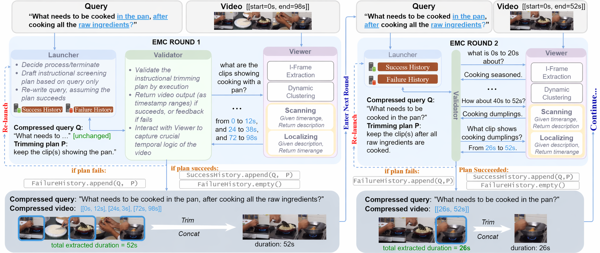

<h1 align="center">EMCompress: Video-LLMs with Endomorphic Multimodal Compression</h1>

<p align="center">
  <strong>Zheyu Fan</strong><sup>*1,2</sup> &nbsp;&middot;&nbsp;
  <strong>Jiateng Liu</strong><sup>1</sup> &nbsp;&middot;&nbsp;
  <strong>Yuji Zhang</strong><sup>1</sup> &nbsp;&middot;&nbsp;
  <strong>Zihan Wang</strong><sup>2</sup> &nbsp;&middot;&nbsp;
  <strong>Yi R. (May) Fung</strong><sup>1</sup> &nbsp;&middot;&nbsp;
  <strong>Manling Li</strong><sup>2</sup> &nbsp;&middot;&nbsp;
  <strong>Heng Ji</strong><sup>1</sup>
  <br>
  <sup>1</sup>University of Illinois Urbana-Champaign &nbsp; <sup>2</sup>Northwestern University
  <br>
  <sup>*</sup>Work done during internship at UIUC.
  <br><br>
  <em>ACL 2026 Findings</em>
</p>

<p align="center">
  <a href="https://arxiv.org/abs/2508.21094"></a>
  <a href="https://huggingface.co/datasets/LordUky/EMCompress"></a>
  <a href="https://github.com/LordUky/EMCompress"></a>
  <a href="LICENSE"></a>
  <a href="https://huggingface.co/datasets/LordUky/EMCompress"></a>
</p>

---

## 📰 News

- **2026.05** &nbsp; 🎉 EMCompress benchmark and reproduction code released on HuggingFace & GitHub.
- **2026.04** &nbsp; 📝 Paper accepted to **ACL 2026 Findings** 🔥.

## 🧠 Overview

Current Video-LLMs treat long-video reasoning as a one-shot, sparse frame-sampling problem — diluting evidence and missing fine-grained temporal semantics. We propose **Endomorphic Multimodal Compression (EMC)**, a cognitively-inspired task that compresses a (Video, Query) pair into a shorter, semantically coherent pair *within the same bimodal space*:

> *F<sub>EMC</sub> : (V, Q) → (v, q)*, preserving answer invariance across reasonable downstream Video-LLMs.

This filter-before-reason economy mirrors human attentional pre-screening (e.g., scrubbing the seek bar before detailed viewing) and recasts long-video QA as a *sufficient-statistic* problem under the Markov chain *A → (V, Q) → (v, q)*.

This repository provides:

1. 🧪 **ReSimplifyIt** — a strong EMC baseline framework (multi-agent: Launcher → Validator → Viewer).
2. 📊 **EMCompress benchmark** — 2,754 cooking-domain QA samples (built on YouCook2) with both EMC-process and standard VideoQA labels.
3. 🛠️ Two-stage reproduction pipeline (Stage 1: EMC process · Stage 2: EMC-guided downstream VideoQA).

## 📐 Formulation

We treat the ground-truth answer $A$ as a latent fact and the (video, query) pair $(V, Q) \sim p(V, Q \mid A)$ as an observation. Any compression $(V, Q) \mapsto (v, q)$ forms the Markov chain

$$A \longrightarrow (V, Q) \longrightarrow (v, q),$$

and the Data Processing Inequality bounds $\, I\!\big((v,q);\,A\big) \le I\!\big((V,Q);\,A\big)\,$ with equality iff $(v, q)$ is an $A$-sufficient statistic of $(V, Q)$. EMC seeks such a sufficient statistic under VideoQA-specific structural constraints, formalized as an endomorphic transformation

$$F_{\mathrm{EMC}} \colon (V, Q) \;\longmapsto\; (v, q)$$

over the original multimodal task space.

**Admissibility conditions.**

- **(C1) Structural Continuity.** $v$ is the concatenation of $n \ge 1$ non-overlapping contiguous sub-segments of $V$:

$$v = \bigcup_{i=1}^{n} \{F_{s_i}, \ldots, F_{e_i}\} \subseteq V, \qquad 1 \le s_1 \le e_n \le T.$$

- **(C2) Answer Sufficiency.** For any reasonable VideoQA agent $M$,

$$M(q, v) = M(Q, V).$$

**Minimality objectives.** Resolved via video-priority lexicographic optimization:

$$(v^{\*}, q^{\*}) \;=\; \Big(\arg\min_{v\,:\,\exists q,\,(v,q)\in\mathcal{A}}\;\mathrm{Size}(v),\;\; \arg\min_{q\,:\,(v^{\*}, q)\in\mathcal{A}}\;\mathrm{Infer}(q)\Big).$$

See paper §2 (and Appendix I) for the full derivation.

## 🏗️ Framework

<p align="center">
  
</p>

See the paper for the full algorithm (Appendix D) and the EMCompress generation protocol (Appendix B).

## 📦 Installation

```bash
git clone https://github.com/LordUky/EMCompress.git
cd EMCompress
conda create -n emc python=3.10 -y
conda activate emc
pip install -r requirements.txt   # openai, transformers, decord, opencv-python, tqdm, ...
```

Create a local `config.py` (gitignored) with your OpenAI key and dataset roots — read the inline comments at the top of the file for what each variable holds.

## 📂 Dataset

The EMCompress benchmark and all 1,080 source videos (~150 GB) are hosted at:

> 🤗 **[huggingface.co/datasets/LordUky/EMCompress](https://huggingface.co/datasets/LordUky/EMCompress)**

For external benchmarks (EgoSchema, LVBench, MLVU, Video-MME, ActivityNet-QA, NExT-QA, NExT-OE), please obtain them from their original sources and place each at `${EMC_DATASETS_DIR}/<DatasetName>/test_split.json` in the schema documented in `emc_utils/utils.py::load_test_split`.

## 🚀 Quickstart

### Stage 1 — EMC Process (ReSimplifyIt)

Produces `screened_timestamps` and `screened_question` for each (video, question) sample:

```bash
# All 7 datasets, ReSimplifyIt-simple + ReSimplifyIt-full
bash run_emc_process.sh 50     # 50 parallel API threads

# Or a single dataset
python run_emc_simple_baseline.py --dataset EMCompress --num_threads 50
python run_emc_full_baseline.py   --dataset EMCompress --num_threads 30
```

### Stage 2 — EMC-Guided Downstream VideoQA

Runs each of 11 video-LLMs (8 local + 3 API) on each dataset, twice (with vs without EMC), for paper Table 2:

```bash
bash run_emc_guided_inference.sh 1 200    # 1 GPU per local-model torchrun, 200 API threads
```

The script auto-routes OpenAI models (`GPT-4o / GPT-4.1-mini / GPT-4-turbo`) through plain Python + threading, and routes local VLMs (`InternVL3.5 / Qwen2.5-VL / Qwen3-VL / LLaVA-OneVision`) through `torchrun` for multi-GPU inference.

### Optional — Frame Captioning

`caption_all_videos.py` precomputes per-frame captions used by ReSimplifyIt's Viewer. Supports OpenAI API and local Qwen-VL / LLaVA-1.5 / LLaVA-NeXT backends auto-routed by `--model`:

```bash
# OpenAI API (any vision-capable model)
python caption_all_videos.py --model gpt-4o --num_threads 32 --skip_existing

# Local Qwen-VL family
torchrun --nproc_per_node=4 caption_all_videos.py --model Qwen/Qwen3-VL-32B-Instruct --skip_existing

# Local LLaVA family
torchrun --nproc_per_node=2 caption_all_videos.py --model llava-hf/llava-v1.6-mistral-7b-hf --skip_existing
```

## 📊 Headline Results

EMC integration yields **relative gains of 7.33% in training and 33.7% in inference** for video-language understanding (see paper Table 2 / Table 3).

| Setup                                              | Δ vs. w/o EMC  |
|----------------------------------------------------|---------------:|
| 11 video-LLMs × 8 datasets, inference-time EMC     | **+33.7%** rel.|
| Video Instruction Tuning w/ EMC labels             | **+7.33%** rel.|

ReSimplifyIt also surpasses prior similar-task baselines by **0.40 F-1** on EMCompress's stage-1 query-rewriting evaluation.

Full per-dataset / per-model numbers in the paper.

## 📝 Citation

If you find this work useful, please cite:

```bibtex
@inproceedings{fan2026emcompress,
  title     = {{EMCompress}: Video-LLMs with Endomorphic Multimodal Compression},
  author    = {Fan, Zheyu and Liu, Jiateng and Zhang, Yuji and Wang, Zihan and
               Fung, Yi R. and Li, Manling and Ji, Heng},
  booktitle = {Findings of the Association for Computational Linguistics: ACL 2026},
  year      = {2026}
}
```

## 📜 License

- **Code** in this repository: **MIT** (see [`LICENSE`](LICENSE)).
- **EMCompress benchmark data** (videos and annotations on HuggingFace): **CC-BY-NC-SA 4.0**, inheriting from YouCook2. Non-commercial research use only.

## 🙏 Acknowledgements

Built on the [YouCook2](http://youcook2.eecs.umich.edu/) cooking-video dataset. We thank the authors of all baseline Video-LLMs evaluated in this work.
